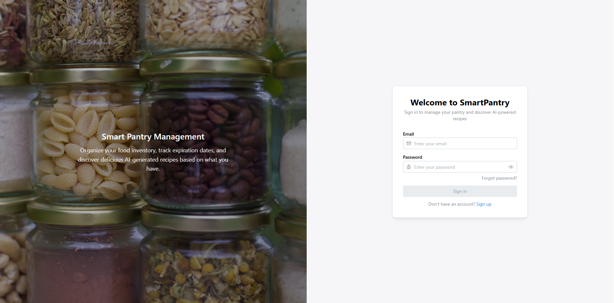
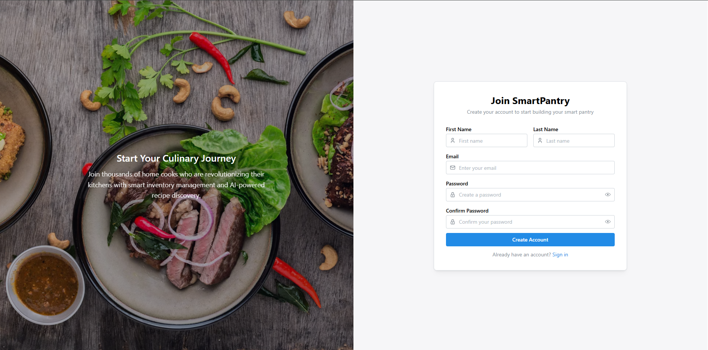
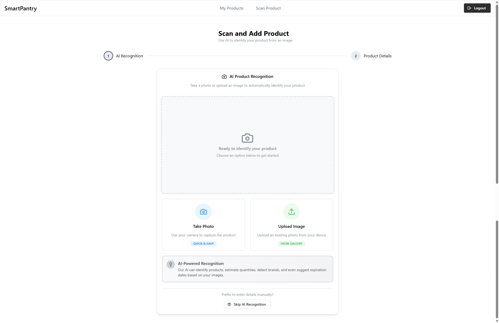
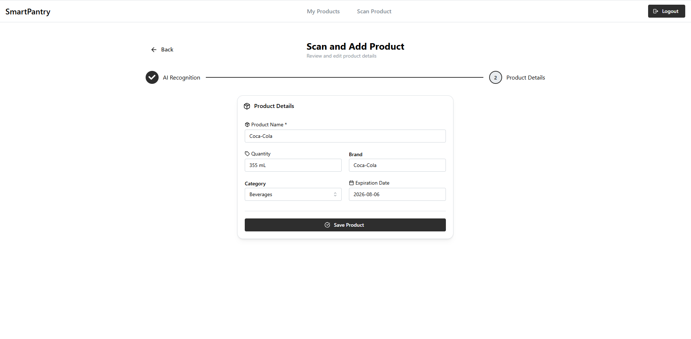
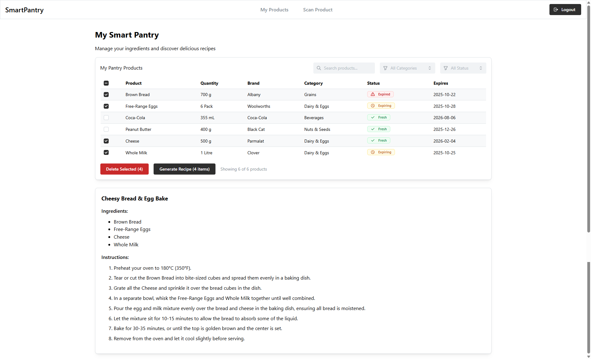

# 🧠 SmartPantry

[-61dafb?logo=react)](https://react.dev/)
[](https://vitejs.dev/)
[](https://dotnet.microsoft.com/)
[](https://learn.microsoft.com/en-us/ef/core/)
[](https://ai.google.dev/)

### Watch the Demo: https://youtu.be/VDaohs2Rv8I

SmartPantry is a full-stack web application that helps users manage their food inventory intelligently.  
Using **Google’s Gemini AI**, it extracts product details from uploaded images and generates personalized recipes based on what’s in your pantry.


## ✨ Overview

This project was developed as part of my **internship at 1Nebula**, showcasing full-stack web development using modern technologies and clean architectural patterns.

SmartPantry combines a **React + TypeScript** frontend (structured with **Bulletproof Architecture**) and an **ASP.NET Core 9 Web API** backend (built with **Onion Architecture**).  
It integrates **Gemini AI** for image-based product extraction and recipe generation.


## 🧩 Core Features

### 🔍 Product Capture (AI Vision)
Upload a grocery item photo — the app uses **Gemini Vision AI** to extract product name, quantity, brand and expiration date automatically.

### 📦 Inventory Management
View and organize pantry items with live updates, search, and filtering.

### 🍽️ Recipe Generation
Leverages **Gemini AI** to suggest creative recipes based on available ingredients.

### 🔐 Authentication
Secure login and registration using **JWT tokens** with hashed password storage.

### ⚙️ Responsive UI
Built with **Mantine v7** for an accessible, mobile-friendly layout.


## 🛠 Tech Stack

| Layer | Technology |
|-------|-------------|
| **Frontend** | React · TypeScript · Vite · Mantine UI · Axios · React Query |
| **Frontend Architecture** | Bulletproof Architecture |
| **Backend** | ASP.NET Core 9 · C# · Entity Framework Core · JWT Authentication |
| **Backend Architecture** | Onion Architecture |
| **Database** | SQL Server (Local) |
| **AI Integration** | Google Gemini Vision + Text API |
| **Testing** | nUnit · FluentAssertions |
| **Dev Tools** | Visual Studio 2022 · VS Code  · Bruno  |


## 🧭 Architecture Overview

```text
SmartPantry
│
├── SmartPantry-frontend/      # React + TypeScript client
│   ├── src/
│   │   ├── components/        # Reusable UI elements
│   │   ├── features/          # Feature modules (ProductCapture, Inventory, Recipes)
│   │   ├── services/          # Axios services + API integration
│   │   ├── hooks/             # React Query & custom hooks
│   │   └── types/             # Shared TS interfaces
│   └── vite.config.ts
│
├── SmartPantry-backend/       # ASP.NET Core 9 API
│   ├── 1-Shared/              # Shared DTOs, constants, helpers
│   ├── 2-DataAccess/          # EF Core, repositories, entities
│   ├── 3-API/                 # Controllers, endpoints, DI setup
│   ├── SmartPantry.Services.Tests/
│   └── SmartPantry.WebApi.Tests/
│
└── Bruno-Collection/          # Bruno API collection for backend testing
    └── SmartPantryAPI.bru
```


## ⚙️ Local Setup

### 🖥 Backend
1. Navigate to `SmartPantry-backend/3-API`
2. Update your `appsettings.Development.json` connection string for local SQL Server.
3. Run database migrations:
   
   ```
   dotnet ef database update
   ```
5. Start the backend API:
   
   ```
   dotnet run
   ```
   API runs on `https://localhost:7182`

### 🌐 Frontend
1. Navigate to `SmartPantry-frontend`
2. Install dependencies:
   
   ```
   npm install
   ```
4. Create a `.env` file:
   
   ```
   VITE_API_BASE_URL=https://localhost:7182
   ```
6. Start the frontend:
   
   ```
   npm run dev
   ```
   Runs on [http://localhost:5173](http://localhost:5173)


## 🧪 API Testing (Bruno Collection)

This repository includes a **Bruno API collection** for testing SmartPantry backend endpoints.  
[Bruno](https://www.usebruno.com/download) is an open-source API client similar to Postman, optimized for speed and version control.

### 🔧 How to use:
1. Install Bruno.  
2. Open it and click **“Import Collection”**.  
3. Import:
   
   ```
   /Bruno-Collection/collection.bru
   ```
5. Configure environment variables:
   
   ```
   base_url = https://localhost:7182
   jwt_token = <token_after_login>
   ```
7. Includes endpoints for:
   - 🔐 Authentication (Register / Login)  
   - 📦 Products (CRUD operations)  
   - 🤖 Gemini AI (Vision + Recipe generation)


## 🧪 Example Flow

1. **Sign up / Log in** — JWT token stored securely in localStorage  
2. **Capture Product Image** — Gemini Vision extracts product info  
3. **View Inventory** — Manage items dynamically  
4. **Generate Recipes** — Gemini AI suggests meals based on your pantry


## 📸 Screenshots
### Login:
 
### Register:

### Product Scan:


### Products / Recipe:



## 🚧 Planned Improvements

- ☁️ Cloud deployment via **Azure App Service + SQL Database**
- 📱 Mobile PWA support
- 👤 User profile management
- 🗂 AI model selector (Gemini 1.5 Pro vs 1.5 Flash)


## 💬 About

**Author:** Meyer Nigrini  
**Role:** Full-Stack Software Engineering Intern @ 1Nebula  
**Location:** Cape Town, South Africa  
**GitHub:** [MeyerNigrini](https://github.com/MeyerNigrini)  
**LinkedIn:** [linkedin.com/in/meyernigrini](https://linkedin.com/in/meyernigrini)


### 🧠 Final Note

SmartPantry showcases my ability to build **end-to-end, scalable web applications** integrating real AI services, JWT authentication, and clean architectures across both frontend and backend.  
It reflects my commitment to producing **well-structured, maintainable, and production-ready** software solutions.
